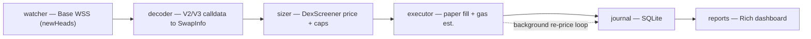

# Base Copy-Trading Bot — Paper Mode

> **Educational / paper-trading only.** This bot **never broadcasts a real
> transaction.** It watches wallets, simulates the trades it would copy, and
> reports simulated P&L. Live execution is a deliberate stub that raises on
> purpose. Do not treat any number it prints as a real return.

A real-time, asynchronous pipeline that watches chosen wallets on the **Base** L2,
decodes their on-chain DEX swaps straight from raw transaction calldata, and
paper-trades a sized copy of each swap — persisting every decision to SQLite and
rendering a terminal P&L dashboard.

The interesting engineering here is the **on-chain data pipeline**: subscribing to
blocks over WebSocket and reconstructing structured swap intent (`tokenIn`,
`tokenOut`, `amountIn`, DEX) directly from Uniswap V2/V3 calldata — no third-party
"decoded transactions" API in the loop.

---

## What it does

| Stage | Module | Responsibility |
|-------|--------|----------------|
| **Watch**   | `watcher.py`  | Subscribes to Base blocks over WebSocket; filters each block's transactions to a configurable wallet watchlist. Auto-reconnects on drop. |
| **Decode**  | `decoder.py`  | Parses raw calldata for Uniswap **V2 & V3** swaps (`exactInputSingle`, `exactInput`, `swapExactTokensForTokens`, `swapExactETHForTokens`, `swapExactTokensForETH`) into a normalized `SwapInfo`. |
| **Size**    | `sizer.py`    | Values the original trade via the DexScreener API and computes a scaled copy (configurable ratio, with min/max caps and a TTL price cache). |
| **Execute** | `executor.py` | Simulates the fill at the current price and estimates the Base gas cost. **No transaction is broadcast.** |
| **Journal** | `journal.py`  | Persists entries, skips, and closed positions to SQLite (WAL mode, parameterized queries). |
| **Report**  | `reports.py`  | A background task re-prices open positions for unrealized P&L; a Rich dashboard shows summary stats, per-wallet breakdown, a trade log, and a cumulative-P&L sparkline. |

## Architecture



## Tech stack

- **Python 3.11+**, `asyncio`
- **`web3.py`** — `AsyncWeb3` + WebSocket provider (block subscription, ERC-20 calls)
- **`eth-abi`** — raw calldata decoding
- **`aiohttp`** — DexScreener price API
- **`sqlite3`** — trade journal (WAL mode)
- **`rich`** — terminal reporting

---

## Setup

```bash
python -m venv .venv && source .venv/bin/activate
pip install -r requirements.txt
cp .env.example .env      # then fill in your own values
```

You need a **Base RPC WebSocket** endpoint (a free Alchemy or Infura key works).

## Configuration

All settings live in `.env` (copy `.env.example` and edit):

| Variable | Meaning | Default |
|----------|---------|---------|
| `BASE_RPC_WSS` / `BASE_RPC_HTTPS` | Base RPC endpoints | *required* |
| `MY_WALLET_ADDRESS` | Identity used to tag paper trades | *required* |
| `MY_PRIVATE_KEY` | Reserved for (future) live mode — not used in paper mode | *required* |
| `WATCHED_WALLETS` | Comma-separated wallets to copy | *required* |
| `COPY_RATIO` | Fraction of their trade size to copy | `0.01` |
| `MIN_TRADE_USD` / `MAX_TRADE_USD` | Copy-size bounds (USD) | `5` / `100` |
| `SLIPPAGE_BPS` | Slippage tolerance for live mode | `50` |
| `PAPER_TRADING` | `true` = simulate (the only supported mode) | `true` |
| `MONITOR_INTERVAL` | Seconds between open-position re-price checks | `60` |
| `MAX_HOLD_HOURS` | Auto-close positions older than this | `24` |

> **Security:** `.env` and `keys.txt` are git-ignored. Never commit a real private
> key — this repository is public.

## Run

```bash
python main.py          # start the bot (Ctrl+C to stop → prints a session report)
python reports.py       # print reports from the existing journal, no bot needed
```

### Example output

```
──────────────────── Trading Bot — Summary Report ────────────────────
  Total trades       42
    Closed           38
    Open              4
  Win rate           55.3%  (21W / 17L)
  Total P&L          $+12.84
  Avg P&L / trade    $+0.34
  Total gas paid     $0.0619
  Avg hold time      37.2 min
  Best trade         #17  WETH→TOSHI  $+4.10
  Worst trade        #29  WETH→DEGEN  $-2.55
```

*(Illustrative numbers — every figure is simulated in paper mode.)*

## Tests

```bash
pip install -r requirements-dev.txt
pytest
```

The suite covers the pure logic that matters most:

- **`decoder.py`** — round-trips real V2/V3 calldata through the decoder and
  asserts the extracted `SwapInfo`, plus the reject paths (non-router `to`,
  unknown selector, truncated input).
- **`sizer.py`** — copy-ratio math, min/max caps, and every skip reason.
- **`journal.py`** — SQLite round-trip and realized-P&L computation on close.

---

## Limitations & roadmap

- **Paper only.** Live execution in `executor.py` is a deliberate stub that raises;
  broadcasting real swaps (approve + `exactInputSingle`, slippage guard, nonce
  management) is intentionally not implemented.
- **Entries, not full round-trips.** The bot mirrors *entries*; exits are a
  time-based auto-close (`MAX_HOLD_HOURS`), **not** a mirror of the copied wallet's
  actual sell. Detecting the wallet's exit transaction is the main next step.
- **Two DEX families.** Only Uniswap V2/V3-style routers on Base are decoded; other
  routers/aggregators are ignored.
- **Mid-price fills.** The paper fill uses the current mid price with no
  slippage/price-impact modeling.

## Disclaimer

This is a personal project built to learn real-time on-chain data processing. It is
**not** financial advice, **not** a production trading system, and has **no** live
track record. Use at your own risk.

## License

[MIT](LICENSE) © 2026 Gabriel Baraban
